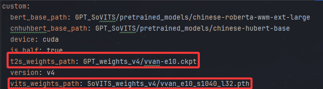
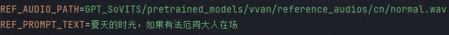

<p align="center">

</p>

<p align="center">
<strong style="font-size:30px;">Live2D-AI-Vivian</strong>
<br>
基于 <b>PyQt5</b> 与本地化 <b>AI音声</b> 驱动的沉浸式 Live2D 桌面伴侣
</p>

<p align="center">
<a href="#-项目简介">项目简介</a> •
<a href="#-功能特性">功能特性</a> •
<a href="#-界面展示">界面展示</a> •
<a href="#-部署指南">部署指南</a> •
<a href="#-致谢">致谢</a>
</p>

<div align="center">

    

   

   
</div>

---

## 📖 项目简介

**Live2D-AI-Vivian** 是一个集成了视觉呈现、语音识别（**ASR**）、大语言模型交互（**LLM**）以及语音合成（**TTS**）的综合性项目，~~旨在打破次元壁~~，利用 **live2d-py**  SDK，让Vivian不仅有动作表现，~~更具备智能灵魂~~。

不同于完全依赖云端的方案，本项目探索适配了本地化音声推理（**Qwen3-ASR** 与 **GPT-SoVITS TTS**），通过部署本地模型，~~以API进行访问的形式体验乐趣~~。

---
## ✨ 功能特性

* [x] **高精度渲染**：基于 `live2d-py` SDK，实现**全功能 Live2D 模型加载、鼠标追踪及物理效果**
* [x] **全链路交互**：
* **语音识别**：支持 **科大讯飞语音 API** 或本地化 **Qwen3-ASR** 推理，通过Import方式选择(~~才不是因为太懒了没做适配~~)
* **智能响应**：适配标准化 **OpenAI API**，可选流式交互与上下文理解(~~同上~~)
* **情感合成**：可集成 **GPT-SoVITS** 本地后端，通过社区模型还原极具表现力的角色声线


* [x] **响应表现**：
* **嘴型同步**：支持 **Lip-Sync 嘴形同步**技术，让角色说话更加自然
* **触摸反馈**：利用`live2d-py` SDK，实现模型**part分类与点击响应处理**
* **状态同步**：利用信号槽机制，实现当前**事务状态同步**，避免产生“卡死”误解
* [x] **妙妙 UI**：采用自定义**透明窗口与气泡对话框**，完美融合桌面环境(~~指能看见桌面~~)

---
## 🖥️ 界面展示
### 触摸反馈


### ASR-LLM-TTS 全链路交互


---

## 🚀 部署指南

### 1. 环境准备

Python 3.9+即可

```bash
git clone https://github.com/Neka-Ev/Live2D-AI-Vivian.git
cd Live2D-AI-Vivian
pip install -r requirements.txt
```

### 2. 配置环境变量

参考 `.env.example` 文件，创建 `.env` 并填写你的 API 密钥及后端地址：

* `DEEPSEEK_API_KEY`: 你的大模型 API 密钥，理论支持OpenAI类
* `GPT_SOVITS_API_URL` / `QWEN_ASR_API_URL`: 本地模型后端地址
* `IFLYTEK_APPID` / `IFLYTEK_API_SECRET` / `IFLYTEK_API_KEY`:讯飞语音识别密钥，新用户[三个月试用](https://www.xfyun.cn/?ch=xfow)
* 其余保证路径正确即可
### 3. 部署本地ASR/TTS服务

本项目在 `backend_adapters` 目录中提供了针对特定模型的适配器(~~其实就是api文件~~)
* **ASR (Qwen3-ASR)**:

    项目使用**Qwen3-ASR模型**作为本地ASR模型部署，只需按照[Qwen3-ASR官方文档](https://github.com/QwenLM/Qwen3-ASR)要求，部署ASR到本地(*使用文档的快速开始即可，不需要使用vLLM*)
    再将 `backend_adapters/Qwen3-ASR/asr_server_api.py` 复制到 **Qwen3-ASR 项目根目录**中运行

* **TTS (GPT-SoVITS)**:

    项目使用**GPT-SoVITS模型**作为本地TTS模型部署，只需按照[GPT-SoVITS官方文档](https://github.com/RVC-Boss/GPT-SoVITS)要求，部署TTS项目到本地
    再将 `backend_adapters/GPT-SoVITS/api_v2.py` 替换 GPT-SoVITS 项目目录下的**api_v2.py**文件，确保接口与客户端高度匹配
    同时，项目使用的声音预训练模型需要从Model Scope的项目模型库下载薇薇安声音模型（[链接](https://modelscope.cn/models/aihobbyist/GPT-SoVITS_Model_Collection/tree/master/%E7%BB%9D%E5%8C%BA%E9%9B%B6/%E4%B8%AD%E6%96%87)），再将pth与ckpt文件的实际路径分别替换至`backend_adapters`下的yaml文件中，再使用此yaml文件替换tts项目`GPT-SoVITS/configs/tts_infer.yaml`文件
    

    最后，将`reference_audios`文件夹下的normal.wav路径确保与.env中的路径一致（这里就可以看出来，若想换音色，只需要让.env的参考音频路径指向新的音频，**但由于是相对tts项目的路径，所以不使用绝对路径情况下需要保证tts项目的api_v2.py能够找到**）
    

### 4. 运行主程序

```bash
python app_main.py
```

---

## 📂 项目结构

```text
├── backend_adapters/     # 后端项目适配器 (用于覆盖 ASR/TTS 项目api)
├── custom_widgets/       # 自定义 PyQt 控件 (气泡框、输入框等)
├── resources/            # 静态资源 (模型文件、音效、图标)
├── utils/                # 辅助工具 (日志、资源加载助手)
├── workers/              # 多线程工作流 (ASR/LLM/TTS 线程)
├── ai_control.py         # 多线程及交互逻辑核心控制逻辑（管理ASR/LLM/TTS线程及模型交互触发逻辑）
├── canvas_base.py        # Live2D 模型画布 (OpenGL渲染核心)
├── canvas_live2d.py      # Live2D 模型表现行为核心控制逻辑（跟踪，触摸反馈及动作）
├── mainwindow.py         # 主显示窗口，包含模型、交互与响应展现的前端
├── app_main.py           # 程序入口
└── .env.example          # 环境配置模板

```

---

## 📅 TODO List

* [ ] **记忆增强**：引入 RAG 及向量数据库，实现长期记忆功能，让模型更拟人！
* [ ] **视觉增强**：引入计算机视觉（CV）模型，实现读取桌面画面，做出更强的交互！
* [ ] **行为增强**：引入时间、待机检测机制，做出更多的状态响应效果！ 

---

## 🙏 致谢与引用

本项目的实现离不开以下优秀开源项目的支持，在此表示诚挚的感谢：

* [live2d-py](https://github.com/EasyLive2D/live2d-py) - 高效的 Live2D Python SDK，项目运作核心，作者给了超多例子，大受启发
* [GPT-SoVITS](https://github.com/RVC-Boss/GPT-SoVITS) - 强大的少样本语音转换与合成，项目部署方式十分详细
* [Qwen3-ASR](https://github.com/QwenLM/Qwen3-ASR) - 优秀的音频理解与强大的识别能力，一个字，绝
* [PyQt5](https://www.riverbankcomputing.com/software/pyqt/) - ~~包成Python的Qt~~，灵活的界面框架支持

本项目用到的Live2D动作来自官方[Live2D 示例数据集](https://www.live2d.com/zh-CHS/learn/sample/)的桃濑日和，并使用[Live2D Cubism](https://www.live2d.com/zh-CHS/cubism/download/editor/)进行了微调

---

## 📄 ~~宇宙~~声明

- **项目遵循MIT开源协议，供个人娱乐与学习使用**
- **所使用的薇薇安（Vivian）角色及形象版权归[米哈游](https://www.mihoyo.com/)所有，由本软件变相产生的音频、动作及形象特征均为二次创作**
- **所使用的 Live2D 模型为作者获得的免费模型， 模型作者：[bilibili 涉谷芒](https://space.bilibili.com/2539974?spm_id_from=333.337.0.0)老师**

<p align="center">
Made with ❤️ by <a href=https://github.com/Neka-Ev>Neka-Ev</a>
</p>